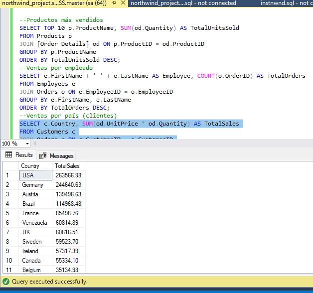

--Northwind SQL Project 🗄

Proyecto práctico de consultas SQL usando la base de datos de ejemplo Northwind de Microsoft.
Este proyecto forma parte de mi portafolio de análisis de datos (Excel , SQL 🗄, Power BI ).

-- --Contenido del repositorio

northwind_project.sql → Archivo con todas las consultas SQL.

README.md → Documentación del proyecto.

 Tecnologías

SQL Server 2022 Express + SSMS

Base de datos Northwind

---- Consultas incluidas

Listado de clientes por país y ciudad.

Ventas totales por empleado.

Productos más vendidos (Top 10).

Ventas por año.

Ventas por categoría de producto.

Ventas totales por cliente.

Pedidos enviados por cada transportista.

Promedio de ventas mensuales.

Clientes sin pedidos en el último año.

Productos con stock bajo.

Ventas totales por región.

Empleados con mayor cantidad de pedidos gestionados.
----Ejemplo de consulta
- Ventas totales por empleado
SELECT e.FirstName, e.LastName, SUM(od.Quantity * od.UnitPrice) AS TotalSales
FROM Employees e
JOIN Orders o ON e.EmployeeID = o.EmployeeID
JOIN [Order Details] od ON o.OrderID = od.OrderID
GROUP BY e.FirstName, e.LastName
ORDER BY TotalSales DESC;

----Cómo usar este proyecto

Descarga la base Northwind e instálala en SQL Server.

Abre el archivo northwind_project.sql en SQL Server Management Studio (SSMS).

Ejecuta las consultas una por una para analizar la información.

 Captura

